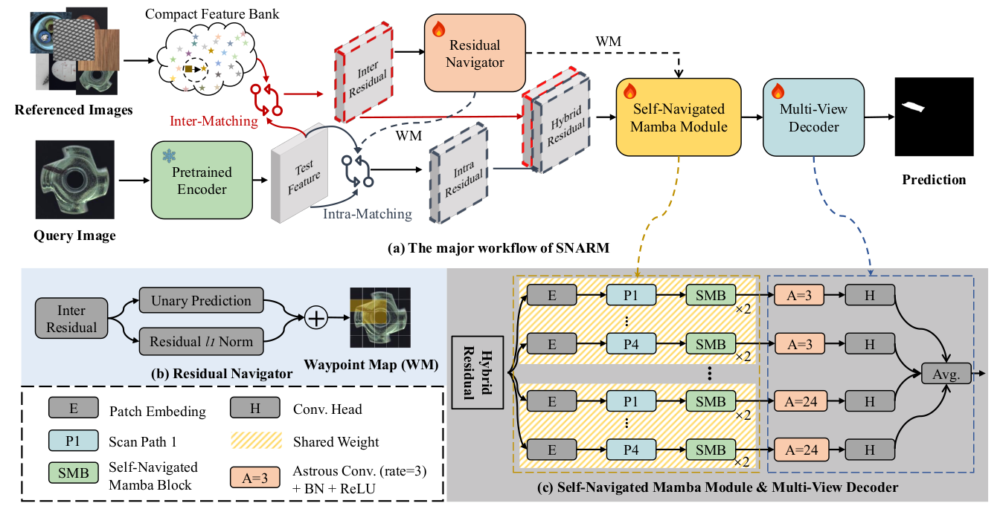

# SNARM
- The official PyTorch implementation of [Self-Navigated Residual Mamba for Universal Industrial Anomaly Detection](https://arxiv.org/abs/2508.01591). This repo is created by Jingqi Wu.
## Abstract
In this paper, we propose Self-Navigated Residual Mamba (SNARM), a novel framework for universal industrial anomaly detection that leverages "self-referential learning'' within test images to enhance anomaly discrimination. Unlike conventional methods that depend solely on pre-trained features from normal training data, SNARM dynamically refines anomaly detection by iteratively comparing test patches against adaptively selected in-image references. Specifically, we first compute the "inter-residuals" features by contrasting test image patches with the training feature bank. Patches exhibiting small-norm residuals (indicating high normality) are then utilized as self-generated reference patches to compute "intra-residuals", amplifying discriminative signals. These inter- and intra-residual features are concatenated and fed into a novel Mamba module with multiple heads, which are dynamically navigated by residual properties to focus on anomalous regions. Finally, AD results are obtained by aggregating the outputs of a self-navigated Mamba in an ensemble learning paradigm. Extensive experiments on MVTec AD, MVTec 3D, and VisA benchmarks demonstrate that SNARM achieves state-of-the-art (SOTA) performance, with notable improvements in all metrics, including Image-AUROC, Pixel-AURC, PRO, and AP. 
## Overview

## Prepare Environments (cuda=11.8)
```shell
 pip install torch==2.4.1 torchvision-0.19.1 --index-url https://download.pytorch.org/whl/cu118
 
git clone https://github.com/Dao-AILab/causal-conv1d.git
cd causal-conv1d
git checkout v1.1.0  # current latest version tag
CAUSAL_CONV1D_FORCE_BUILD=TRUE pip install .
cd ..

git clone https://github.com/state-spaces/mamba.git
cd mamba
git checkout v1.1.1 # current latest version tag
pip install .
cd ..

pip install -r requirements.txt

```
## Prepare Dataset
- set dataset/config.py
- run dataset/preprocess_mvtec.py
## Experiments
### Multi-class
#### Train
- The training code will be made available upon the paper’s acceptance.

#### Test
```shell
dir=data/defect_392/mvtec

for item  in  `ls $dir`; do

python  test_with_bank.py --detection-model snarm --data-root data/defect_392/mvtec --dataset $item --exp 1 --depths 2 \
 --feature-channel 1024   --gt-size 392 392  --scan 4   --unify \
  --with-image-feature  --k-ratio 100000 --topk 3 --bank-name mvtec_multi_class_1_8_100k_exp1 \
  --residual-method concat_abs_square  --self-ratio 0.75  \
   --local-layers  blocks.1 blocks.2 blocks.3 blocks.4 blocks.5 blocks.6 blocks.7 blocks.8  \
--exp-name iter100_scan4_mvtec_multi_class_1_8_100k_topk3_jitter_lr1e-3_snarm_depths2_alpha0.25_0.5_48 \
 --num-steps 40000 --pred-pixel
sleep 20
done
```
## Acknowledgements
We sincerely appreciate [PatchCore](https://github.com/amazon-science/patchcore-inspection), [DRAEM](https://github.com/VitjanZ/DRAEM), [Mamba](https://github.com/state-spaces/mamba), [Dinomaly](https://github.com/guojiajeremy/Dinomaly), [UniAD](https://github.com/OpenDriveLab/UniAD), and [INP-Former](https://github.com/luow23/INP-Former?tab=readme-ov-file) for providing open-source implementations that greatly facilitated our research.
## Citation
If our work is helpful for your research, please consider citing:
```
@article{li2025self,
  title={Self-Navigated Residual Mamba for Universal Industrial Anomaly Detection},
  author={Li, Hanxi and Wu, Jingqi and Wu, Lin Yuanbo and Li, Mingliang and Liu, Deyin and Shen, Jialie and Shen, Chunhua},
  journal={arXiv preprint arXiv:2508.01591},
  year={2025}
}
```